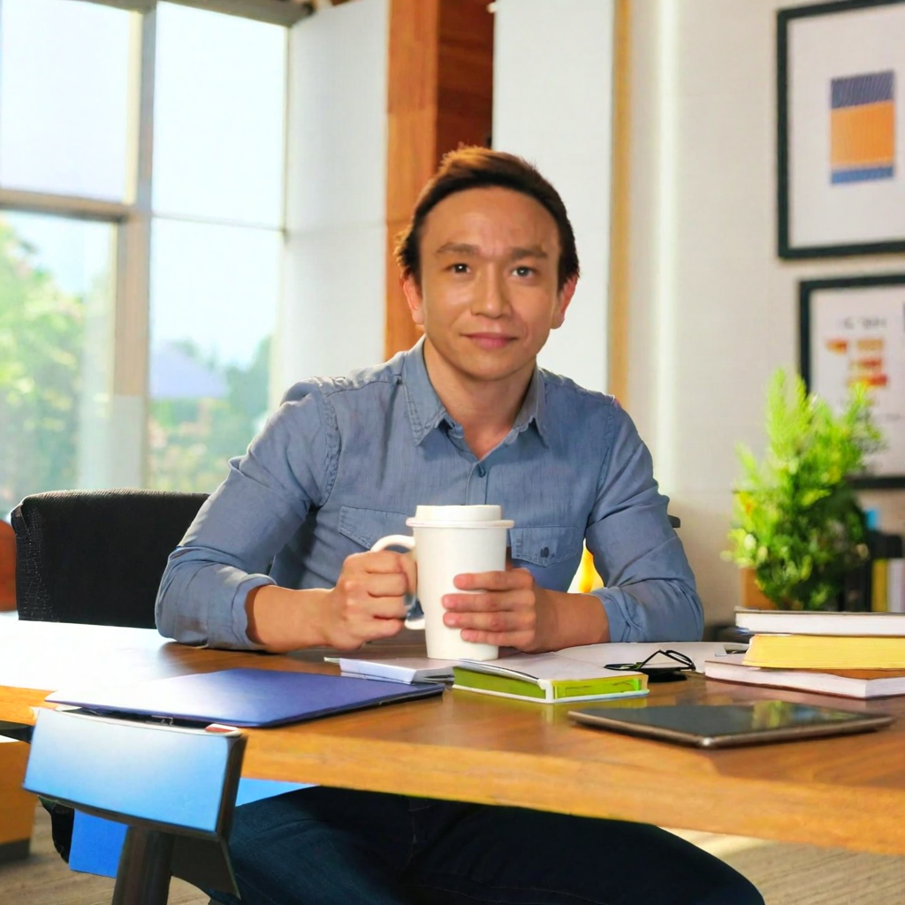
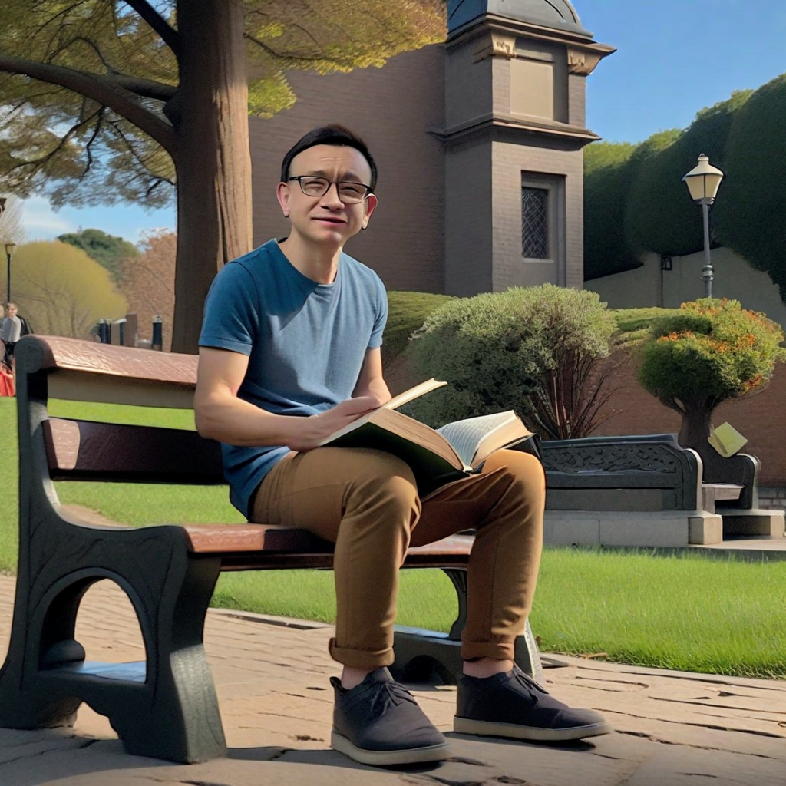
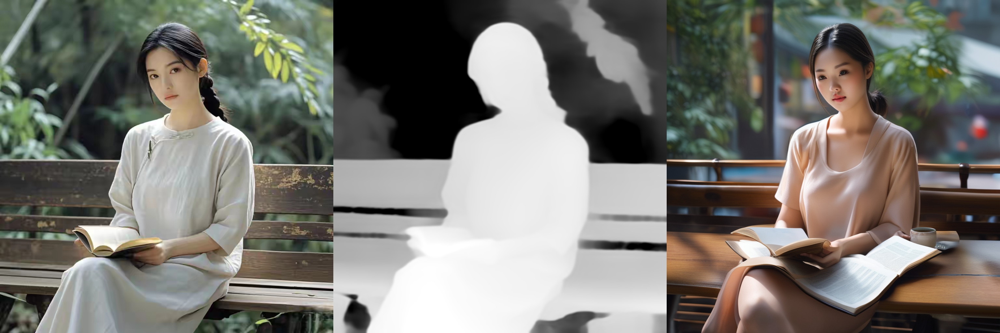

  
# Multimodal LLM Study: Comprehensive Generative Suite

This repository is an all-in-one suite for open-source state-of-the-art **Multimodal Large Language Models**. It demonstrates examples for multimodal content generation by MMLLM across multiple mediums, including **text, images, video, and audio**. By leveraging cutting-edge architectures like Diffusion Transformers and Latent Consistency Models, you can build sophisticated generative image, video and speech with optimized latency and compute resources, as well as minimum costs. 

---

## 🚀 Text-to-Image (T2I)
Generate high-fidelity visual art and photorealistic images from natural language descriptions. 
* **Open-source Models:** Qwen-Image, SDXL, SD-1.5, Kandinsky 
* **Key Features:** negative prompting, LoRA weights, and control net

3D model                                                                                     |  Anime
:-------------------------------------------------------------------------------------------:|:------------------------------------------------------------------------------------------------:
  |  

Comic                                                                                   |  Line art
:--------------------------------------------------------------------------------------:|:-------------------------------------------------------------------------------------------:
  |  

[Click here](text_to_image.md) to view configurations and examples

## 🚀 Image-to-Image (I2I)
Transform existing images into new styles or modify specific elements while maintaining structural integrity.
* **Open-source Models:** Qwen-Image-Edit, SDXL, RealVisXL_V4.0, controlnet-depth-sdxl-1.0-small, autoencoderKL vae: sdxl-vae-fp16-fix, 
* **Key Features:** negative prompting, inpainting, outpainting, masking, style tranfer/IP-adapter including face adapter, T2I adapter, control net, depth-map guided generation

Face                                                               |  Generated
:-----------------------------------------------------------:|:-------------------------------------------------------------------------:
 |

Face                                                                 |  Generated
:-------------------------------------------------------------:|:--------------------------------------------------------------------------:
 |

Original image | Mask image | Generated image        

[Click here](image-to-image.md) to view configurations and examples 

## 🚀 Text-to-Video (T2V)
Convert descriptive prompts into dynamic, high-definition video clips with consistent temporal coherence.
* **Open-source Models:** Wan-2.1, modelscope, LTX-video, AnimateDiff motion adapter 
* **Key Features:** frame rate control, and resolution scaling.

https://github.com/user-attachments/assets/41add3a3-903f-4fe9-97b9-59d3ce9f9fc1

[Click here](text_to_video.md) to view configurations and examples 

## 🚀 Image-to-Video (I2V)
Animate static images into 3–5 second cinematic clips using advanced optical flow estimation.
* **Open-source Models:** SVD-img2vid-xt
* **Key Features:** keyframe animation

https://github.com/user-attachments/assets/67ee972b-27a3-40d4-92a0-8cb8bf6f60b4

[Click here](image_to_video.md) to view configurations and examples 

## 🚀 Text-to-Audio (T2A)
Generate high-quality sound effects, ambient soundscapes, or musical compositions from text.
* **Open-source Models:** Speech-T5, MMS-TTS, Kokoro TTS, musicgen-small, Coqui TTS (XTTS v2)
* **Key Features:** voice cloning, multi-language support, duration control

[Click here](text_to_speech.md) to view configurations and examples 

---

### 📄 License
This project is licensed under the **MIT License** - see the `LICENSE` file for details.
