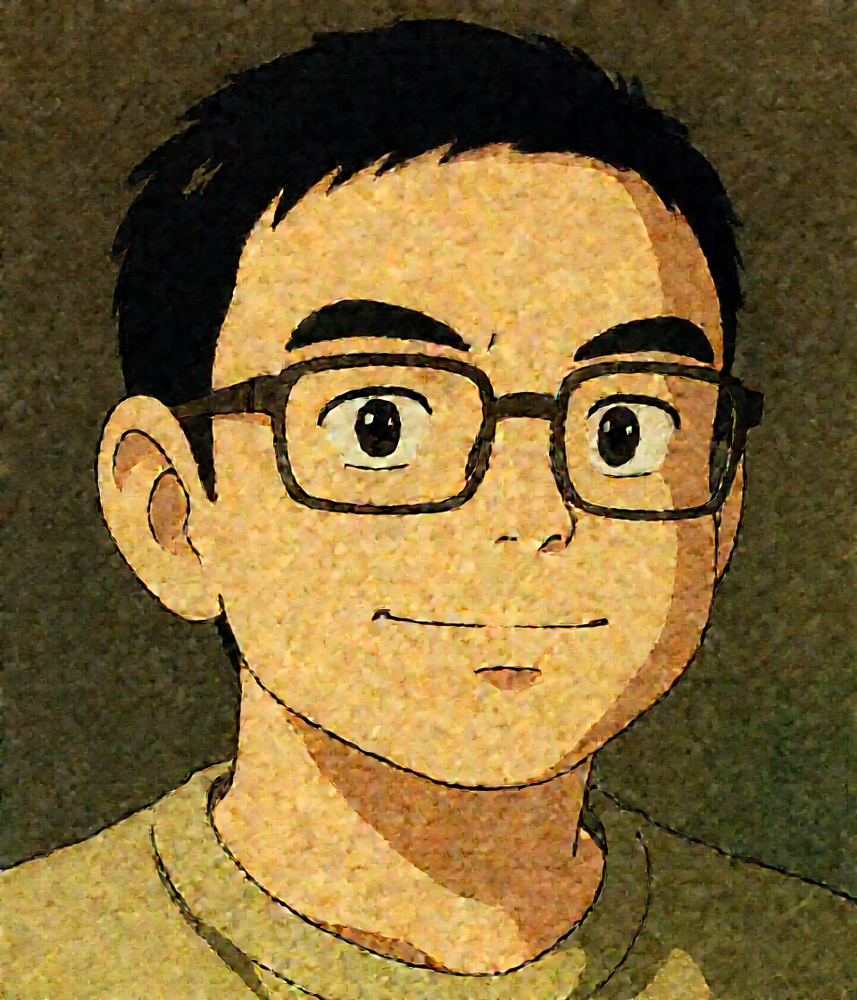
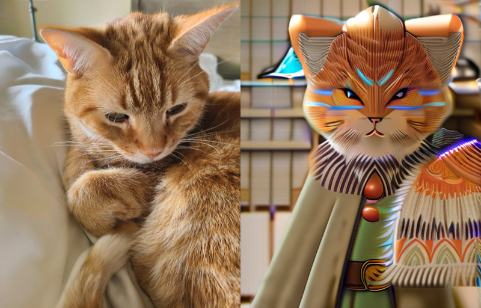
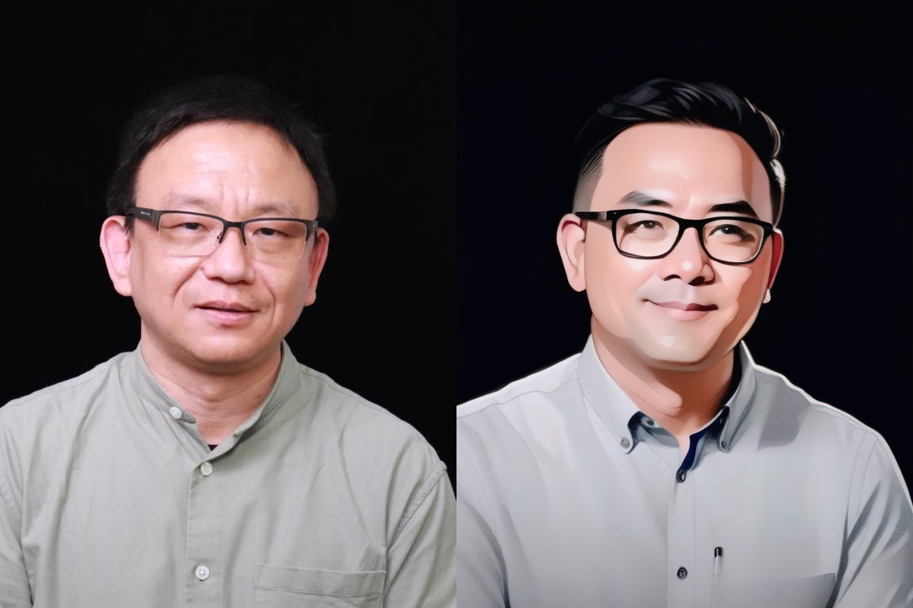
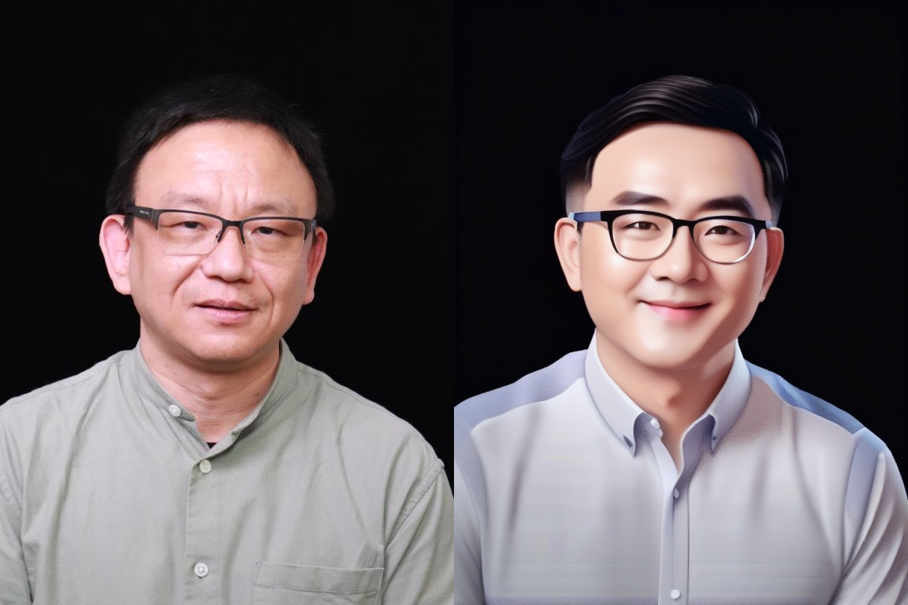
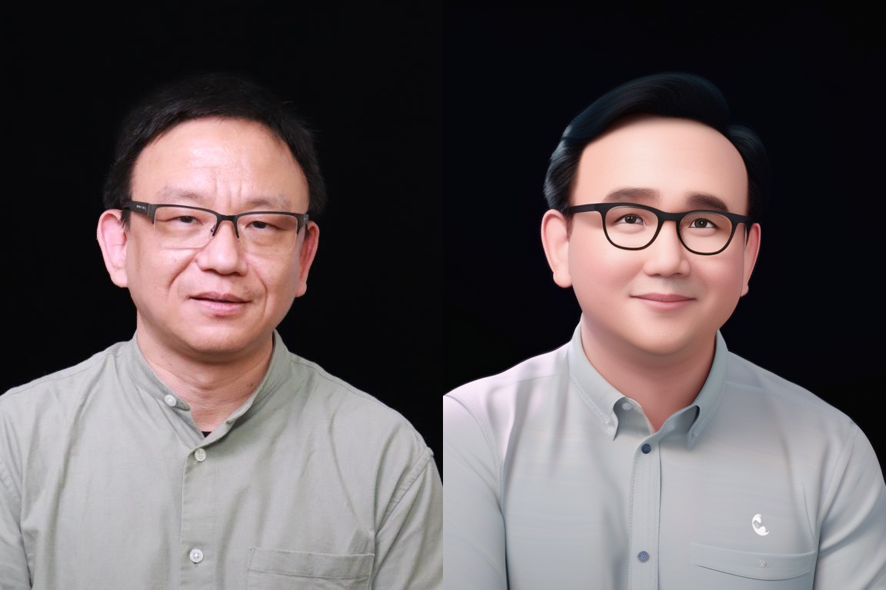

## Image to Image 

This work is performed on RTX 3090 GPU (24GB)

### Qwen-Image-Edit model  

Load model in 4-bit quantization 
```
quantization_config = PipelineQuantizationConfig(
    quant_backend="bitsandbytes_4bit",
    quant_kwargs={
        "load_in_4bit": True,
        "bnb_4bit_quant_type": "nf4",
        "bnb_4bit_compute_dtype": torch.bfloat16
    },
    components_to_quantize=["transformer", "text_encoder"],
)
```
Prompt 
"Transform the image into Ghibli style."

Original image                                                      |  Generated image
:------------------------------------------------------------------:|:------------------------------------------------------------------------:
 |  

### SDXL 

negative_prompt = "ugly, deformed, disfigured, poor details, bad anatomy"      
prompt = "cat wizard, gandalf, lord of the rings, detailed, fantasy, cute, adorable, Pixar, Disney, 8k"

Using upscaler 
```
upscaler = StableDiffusionLatentUpscalePipeline.from_pretrained(
    "stabilityai/sd-x2-latent-upscaler", 
    torch_dtype=torch.float16, 
    use_safetensors=True
)
```



Different style     

Comic art                                                                           |  Digital artwork
:----------------------------------------------------------------------------------:|:-----------------------------------------------------------------------------------:
 |

Isometric art                                                                           | 3D cartoon
:--------------------------------------------------------------------------------------:|:-------------------------------------------------------------------------------------:
 |


