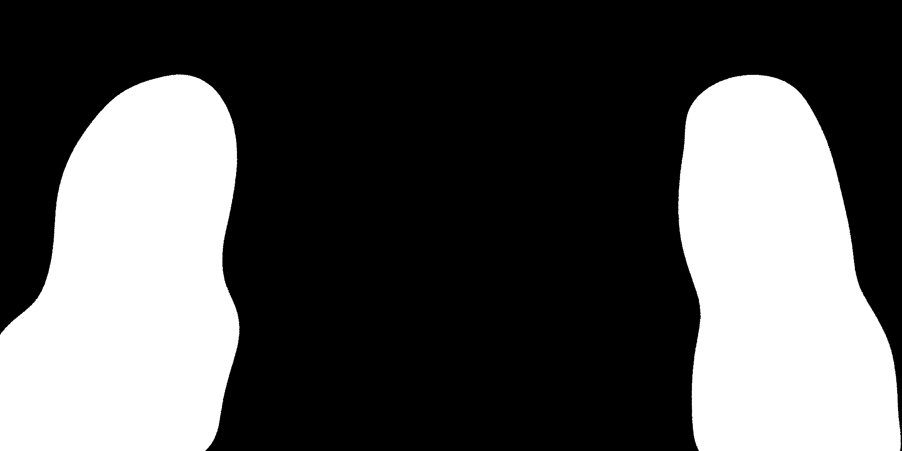
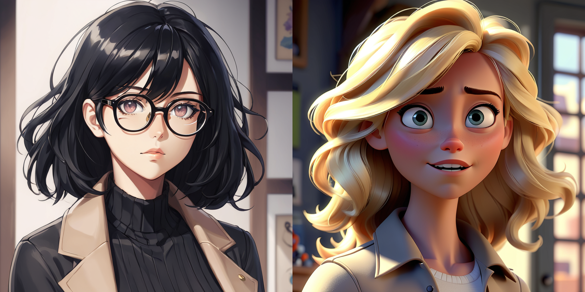
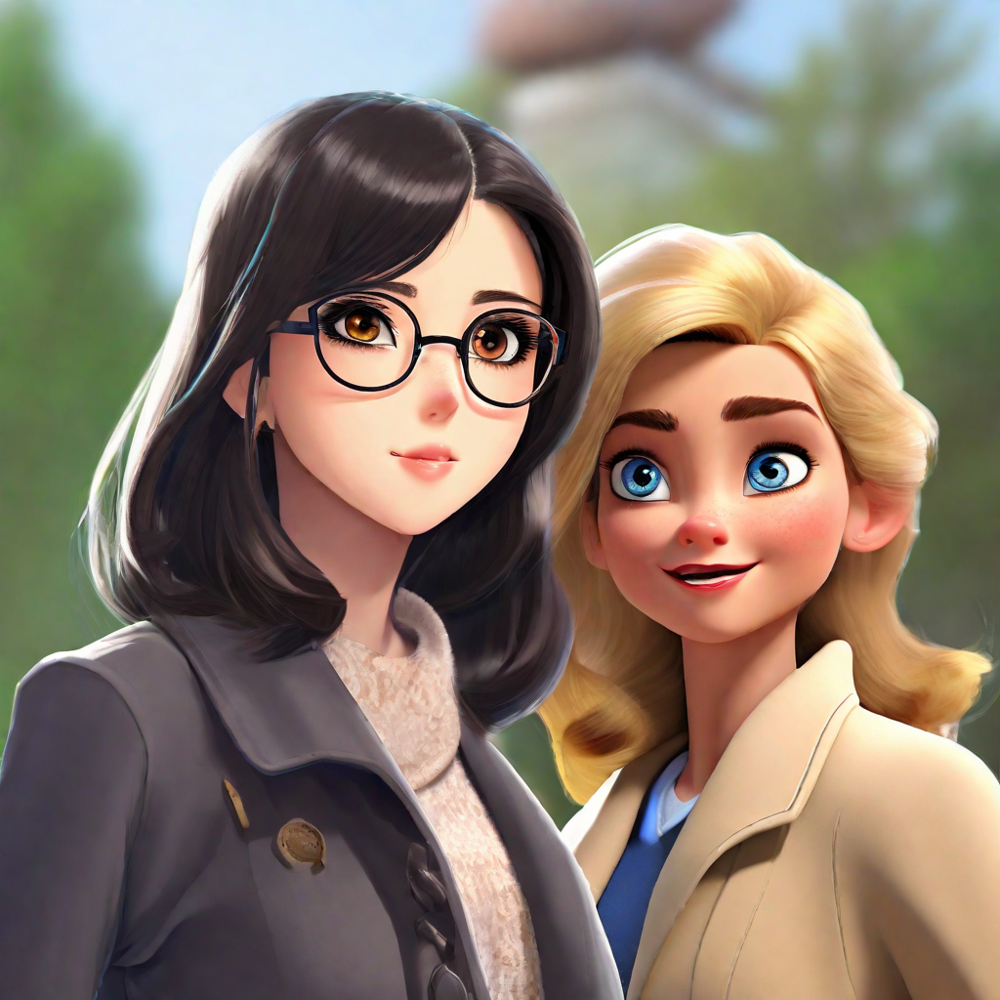
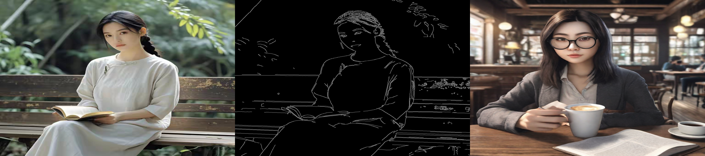

## Image to Image 

This work is performed on RTX 3090 GPU (24GB)

### Qwen-Image-Edit model  

Load model in 4-bit quantization 
```
quantization_config = PipelineQuantizationConfig(
    quant_backend="bitsandbytes_4bit",
    quant_kwargs={
        "load_in_4bit": True,
        "bnb_4bit_quant_type": "nf4",
        "bnb_4bit_compute_dtype": torch.bfloat16
    },
    components_to_quantize=["transformer", "text_encoder"],
)
```
Prompt 
"Transform the image into Ghibli style."

Original image                                                      |  Generated image
:------------------------------------------------------------------:|:------------------------------------------------------------------------:
 |  

### SDXL 

negative_prompt = "ugly, deformed, disfigured, poor details, bad anatomy"      
prompt = "cat wizard, gandalf, lord of the rings, detailed, fantasy, cute, adorable, Pixar, Disney, 8k"

Using upscaler 
```
upscaler = StableDiffusionLatentUpscalePipeline.from_pretrained(
    "stabilityai/sd-x2-latent-upscaler", 
    torch_dtype=torch.float16, 
    use_safetensors=True
)
```


Different style     

Comic art                                                                           |  Digital artwork
:----------------------------------------------------------------------------------:|:-----------------------------------------------------------------------------------:
 |

Isometric art                                                                           | 3D cartoon
:--------------------------------------------------------------------------------------:|:-------------------------------------------------------------------------------------:
 |


## Inpainting
Model: SDXL-base 

Prompt = "boat" 


## Outpainting
Model: "SG161222/RealVisXL_V4.0"      
Control Net model: "destitech/controlnet-inpaint-dreamer-sdxl", "diffusers/controlnet-zoe-depth-sdxl-1.0"      
Vae model: "madebyollin/sdxl-vae-fp16-fix"      


## Masking 
Model: SDXL-base

Load IP adapter model: "h94/IP-Adapter"
```
pipeline.load_ip_adapter(
  "h94/IP-Adapter",
  subfolder="sdxl_models",
  weight_name="ip-adapter_sdxl.bin"
)
pipeline.set_ip_adapter_scale([[0.7, 0.7]])
```
Mask images:



Face images:



Negative_prompt: "monochrome, lowres, bad anatomy, worst quality, low quality"
Prompt: "2 girls"

Generated image: 




## IP adapters
Model: SDXL-base    
Image encoder: "h94/IP-Adapter"     

Load IP adapters: "h94/IP-Adapter"      
```
pipeline.load_ip_adapter(
  adapter_id,
  subfolder="sdxl_models",
  weight_name=["ip-adapter-plus_sdxl_vit-h.safetensors", "ip-adapter-plus-face_sdxl_vit-h.safetensors"]
)

pipeline.set_ip_adapter_scale([0.3,0.7])
```

Negative_prompt: "monochrome, lowres, bad anatomy, worst quality, low quality"      

Prompt: "A photo of a young man, sitting at an office desk with a cup of coffee."

Face                                                               |  Generated
:-----------------------------------------------------------------:|:-----------------------------------------------------------------------------------:
 |


Prompt: "A photo of a young man, sitting on a stone bench in a park, reading a book."

Face                                                                 |  Generated
:-------------------------------------------------------------------:|:------------------------------------------------------------------------------------:
 |

Use Control Net 
```
controlnet = ControlNetModel.from_pretrained(
  "diffusers/controlnet-depth-sdxl-1.0-small",
  torch_dtype=torch.float16
)
vae = AutoencoderKL.from_pretrained(
    "madebyollin/sdxl-vae-fp16-fix",
    torch_dtype=torch.float16
)
```

Prompt: 
```
A photorealistic overhead image of a young Chinese woman, sitting in a coffee shop, reading a book. 
The woman is seriously thinking about some important matters.
```

Original image | Mask image | Generated image        


## T2I adapter   
Mode: SDXL-base       
Multiple adapters      
```
t2i_adapter_1 = T2IAdapter.from_pretrained(
    "TencentARC/t2i-adapter-canny-sdxl-1.0",
    torch_dtype=torch.float16,
)
t2i_adapter_2 = T2IAdapter.from_pretrained(
    "TencentARC/t2i-adapter-depth-midas-sdxl-1.0", 
    torch_dtype=torch.float16
)
adapters = MultiAdapter([t2i_adapter_1,t2i_adapter_2])

vae = AutoencoderKL.from_pretrained(
    "madebyollin/sdxl-vae-fp16-fix",
    torch_dtype=torch.float16
)
```

Prompt:    
```
A photorealistic overhead image of a young Japanese woman, wearing black glasses, 
sitting in a coffee shop, reading a book, with a cup of coffee on the table, 8k, highly detailed
```

Original image | Canny image | Generated image        



