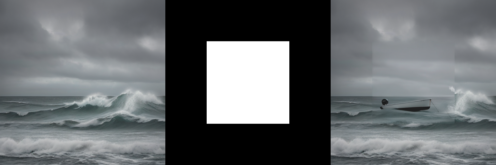

## Image to Image 

This work is performed on RTX 3090 GPU (24GB)

### Qwen-Image-Edit model  

Load model in 4-bit quantization 
```
quantization_config = PipelineQuantizationConfig(
    quant_backend="bitsandbytes_4bit",
    quant_kwargs={
        "load_in_4bit": True,
        "bnb_4bit_quant_type": "nf4",
        "bnb_4bit_compute_dtype": torch.bfloat16
    },
    components_to_quantize=["transformer", "text_encoder"],
)
```
Prompt 
"Transform the image into Ghibli style."

Original image                                                      |  Generated image
:------------------------------------------------------------------:|:------------------------------------------------------------------------:
 |  

### SDXL 

negative_prompt = "ugly, deformed, disfigured, poor details, bad anatomy"      
prompt = "cat wizard, gandalf, lord of the rings, detailed, fantasy, cute, adorable, Pixar, Disney, 8k"

Using upscaler 
```
upscaler = StableDiffusionLatentUpscalePipeline.from_pretrained(
    "stabilityai/sd-x2-latent-upscaler", 
    torch_dtype=torch.float16, 
    use_safetensors=True
)
```


Different style     

Comic art                                                                           |  Digital artwork
:----------------------------------------------------------------------------------:|:-----------------------------------------------------------------------------------:
 |

Isometric art                                                                           | 3D cartoon
:--------------------------------------------------------------------------------------:|:-------------------------------------------------------------------------------------:
 |


## Inpainting
Model: SDXL-base 

Prompt = "boat" 

 


## Outpainting
Model: "SG161222/RealVisXL_V4.0"      
Control Net model: "destitech/controlnet-inpaint-dreamer-sdxl", "diffusers/controlnet-zoe-depth-sdxl-1.0"      
Vae model: "madebyollin/sdxl-vae-fp16-fix"      


## Masking 
Model: SDXL-base

Load IP adapter model: "h94/IP-Adapter"
```
pipeline.load_ip_adapter(
  "h94/IP-Adapter",
  subfolder="sdxl_models",
  weight_name="ip-adapter_sdxl.bin"
)
pipeline.set_ip_adapter_scale([[0.7, 0.7]])
```
Mask immmages:

Face images:

Negative_prompt: "monochrome, lowres, bad anatomy, worst quality, low quality"
Prompt: "2 girls"


## IP adapters

