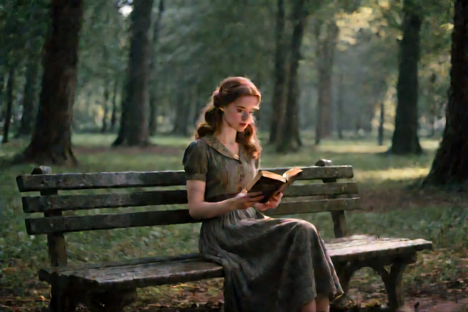
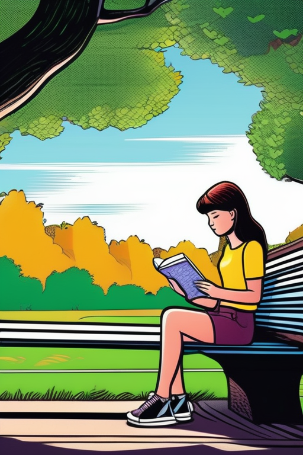
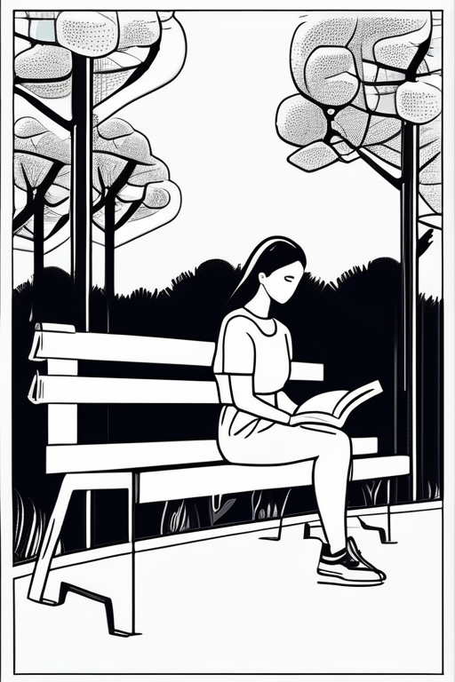
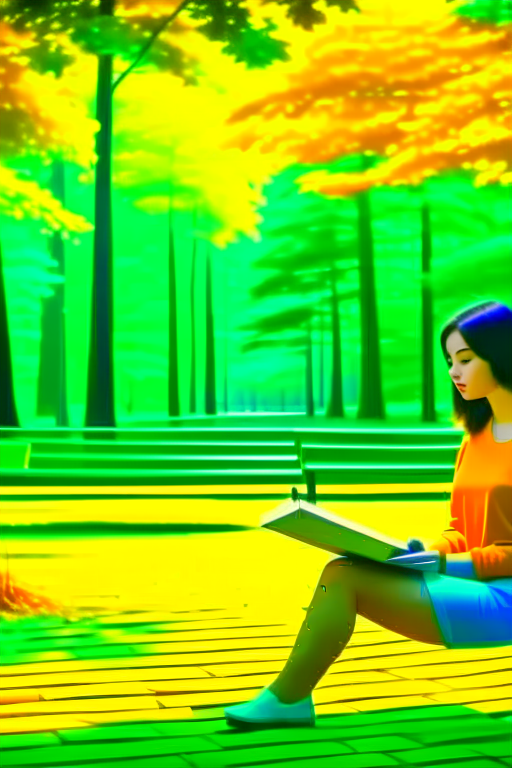
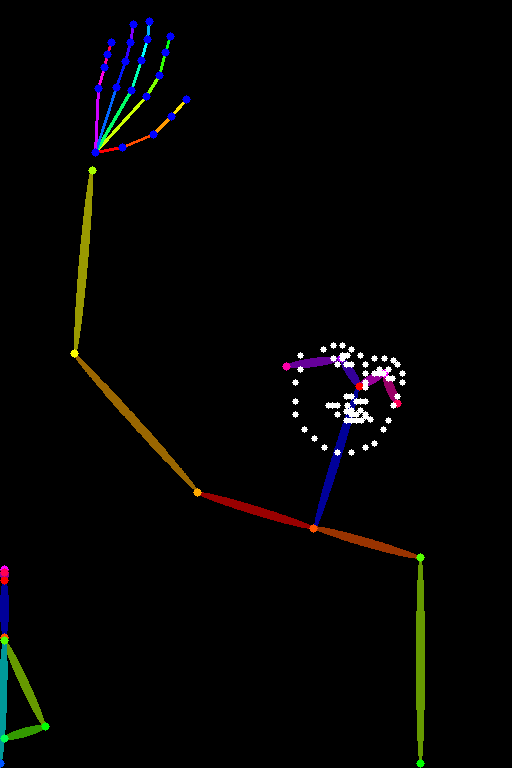
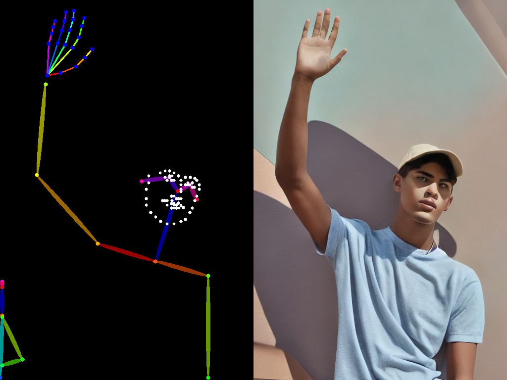

## Text to Image 

This work is performed on RTX 3090 GPU (24GB)

### Qwen-Image model  

Load model in 4-bit quantization 

```
quantization_config = PipelineQuantizationConfig(
    quant_backend="bitsandbytes_4bit",
    quant_kwargs={
        "load_in_4bit": True,
        "bnb_4bit_quant_type": "nf4",
        "bnb_4bit_compute_dtype": torch.bfloat16
    },
    components_to_quantize=["transformer", "text_encoder"],
)
```

Configure positive magic and negative prompt 

```
positive_magic = {
    "en": ", Ultra HD, 8K, cinematic composition.",  
}

negative_prompt = "low quality, blurry, ugly, poor details"
```

You can add a LoRA adapter to improve the image generation quality 
```
pipeline.load_lora_weights(
  "flymy-ai/qwen-image-realism-lora",
)
```

Prompt: 
```
super realism cinematic film still of a young woman sitting on a bench reading a book, in a forest park. 
highly detailed, high budget hollywood movie, cinemascope, moody, epic, gorgeous, film grain   
```

 

### SDXL model 

Configure negative prompt 

```
negative_prompt="ugly, deformed, disfigured, poor details, bad anatomy"
```

Prompt: 
```
super realism cinematic film still of a young woman sitting on a bench reading a book, in a forest park. 
highly detailed, high budget hollywood movie, cinemascope, moody, epic, gorgeous, film grain   
```

 

Different style 

3D model                                            |  Anime
:--------------------------------------------------:|:--------------------------------------------------:
  |  

Comic                                               |  Line art
:--------------------------------------------------:|:--------------------------------------------------:
  |  

### Kandinsky model 

Configure negative prompt 

```
negative_prompt="ugly, deformed, disfigured, poor details, bad anatomy"
```

Prompt: 
```
super realism cinematic film still of a young woman sitting on a bench reading a book, in a forest park. 
highly detailed, high budget hollywood movie, cinemascope, moody, epic, gorgeous, film grain   
```

 


### SD-1.5 with Control Net 

Load control net model 
```
controlnet = ControlNetModel.from_pretrained(
	control_net_model_id, 
    torch_dtype=torch.float16, 
    variant="fp16",
    use_safetensors=True
).to("cuda")
```

Prompt: A young man, cold color palette, muted colors, detailed, 8k 

3D model                                            |  Anime
:--------------------------------------------------:|:--------------------------------------------------:
  |  

